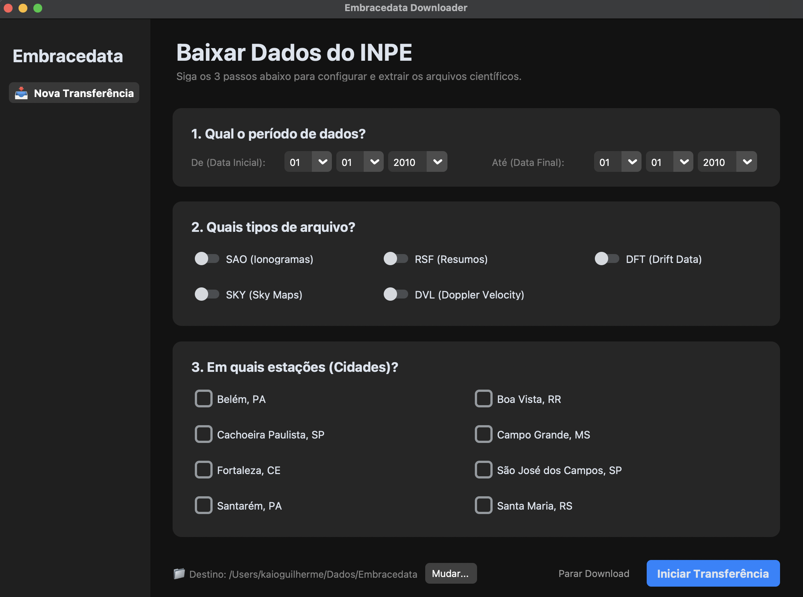

# Embracedata Downloader 📥



O **Embracedata Downloader** é uma ferramenta gráfica que facilita o download automatizado de dados espaciais (clima espacial e geofísicos) da plataforma Embracedata do INPE. Com uma interface estilo Apple (simples, descritiva e acessível), a ferramenta foi desenhada especialmente para pesquisadores, doutores e leigos.

## 🚀 Novidades da Versão 2.0
- **Motor Web Scraping:** Chega de erros 404! O sistema agora vasculha o diretório do INPE antes de tentar baixar os arquivos, descobrindo com 100% de precisão o que existe no servidor.
- **Multithreading Inteligente:** A velocidade foi multiplicada. O motor detecta o número de núcleos do seu processador e abre até dezenas de conexões em paralelo (Threads I/O bound).
- **Interface Descomplicada:** Layout totalmente remodelado. Datas se auto-ajustam, cidades e tipos estão detalhados em linguagem clara.

## 📦 Como Baixar e Executar (Windows, Mac, Linux)
Você **não precisa instalar o Python** se não for desenvolvedor. O repositório compila automaticamente executáveis prontos para uso:

1. Acesse a aba [Releases](https://github.com/KaioGuilherme/Embracedata-downloader/releases) deste repositório no GitHub.
2. Baixe o pacote para o seu sistema operacional:
   - **macOS (Apple Silicon / M-series)**: Baixe o arquivo `.dmg` (ou `.zip`). Abra o `.dmg` e arraste para a pasta Aplicativos (ou execute direto).
     > **Nota de Segurança no macOS (Gatekeeper)**: Na primeira vez que abrir, caso apareça aviso de desenvolvedor não verificado, clique com o **botão direito (Control + Clique)** sobre o app, selecione **Abrir** e confirme, ou acesse **Ajustes do Sistema → Privacidade e Segurança** e clique em **Abrir Mesmo Assim**.
   - **Windows 10/11**: Baixe o `.exe` e dê duplo clique para abrir.
   - **Linux**: Baixe o binário e dê permissão de execução: `chmod +x Embracedata_Downloader-linux && ./Embracedata_Downloader-linux`.

---

## 🛠 Para Desenvolvedores

### Pré-requisitos
* **Python 3.12+**
* [Poetry](https://python-poetry.org/)

### Instalação e Execução local
```bash
git clone https://github.com/KaioGuilherme/Embracedata-downloader.git
cd Embracedata-downloader
poetry install
poetry run python main.py
```

### Build Manual via PyInstaller

#### macOS (.app bundle com ícone e temas):
```bash
poetry run pyinstaller --noconfirm --onedir --windowed \
  --name "Embracedata Downloader" \
  --icon "icons/icon.icns" \
  --osx-bundle-identifier "br.inpe.embracedata.downloader" \
  --collect-all customtkinter \
  main.py
```

#### Windows (.exe):
```bash
poetry run pyinstaller --noconfirm --onefile --windowed --name "Embracedata_Downloader-windows" --icon "icons/icon.ico" --collect-all customtkinter main.py
```

## 📖 Como Usar

1. **Configure o Período**
   - Defina o ano inicial e final (ex: 2020 a 2024)
   - Defina o dia juliano inicial e final (1 a 366)

2. **Selecione os Tipos de Arquivo**
   - ☑️ SAO - Ionogramas em formato SAO
   - ☑️ RSF - Arquivos RSF
   - ☑️ DFT - Arquivos DFT 
   - ☑️ SKY - Arquivos SKY
   - ☑️ DVL - Arquivos DVL 

3. **Escolha as Cidades**
   - BLJ03 - Belém
   - BVJ03 - Boa Vista
   - CAJ2M - Cachoeira Paulista
   - CGK21 - Campo Grande
   - FZA0M - Fortaleza
   - SAA0K - São José dos Campos
   - SAJ03 - Santarém
   - SMK29 - Santa Maria

4. **Selecione o Diretório de Destino**
   - Clique em "Selecionar Diretório"
   - Escolha onde salvar os arquivos (padrão: `./Dados`)

5. **Inicie o Download**
   - Clique em "Iniciar Download"
   - Acompanhe o progresso na área de logs
   - Use "Cancelar Download" se necessário

## 📊 Tipos de Dados Disponíveis

| Tipo | Descrição | Formatos |
|------|-----------|----------|
| SAO | Ionogramas em formato SAO | 000 |
| RSF | Arquivos de resumo RSF | 000 |
| DFT | Drift Data Files | 430, 700 |
| SKY | Sky Map Files | 430, 700 |
| DVL | Doppler Velocity Log | 430, 700 |

## 🏗️ Estrutura do Projeto

```
Embracedata-downloader/
├── main.py                    # Interface gráfica CustomTkinter
├── engine.py                  # Motor de scraping e download concorrente
├── pyproject.toml             # Configuração do Poetry e dependências
├── poetry.lock                # Lockfile de dependências
├── LICENSE                    # Licença MIT
├── README.md                  # Documentação do projeto
├── icons/                     # Ícones da aplicação
│   ├── icon.icns             # Ícone macOS
│   ├── icon.ico              # Ícone Windows
│   └── icon.png              # Ícone genérico
└── .github/
    └── workflows/
        └── build.yaml         # Pipeline CI/CD GitHub Actions (Linux, macOS, Windows)
```

## 🛠️ Desenvolvimento

### Configurar Ambiente de Desenvolvimento

```bash
# Instalar dependências de desenvolvimento
poetry install --with dev,build

# Executar testes
poetry run task test

# Verificar formatação de código
poetry run task lint
```

## 🔍 Logs

Todos os downloads são registrados no arquivo `Inpe_download.log` com:
- Timestamp de cada operação
- URLs acessadas
- Status de sucesso/falha
- Erros encontrados

## 🤝 Contribuindo

Contribuições são bem-vindas! Por favor:

1. Fork o projeto
2. Crie uma branch para sua feature (`git checkout -b feature/MinhaFeature`)
3. Commit suas mudanças usando Commitizen (`poetry run task commit`)
4. Push para a branch (`git push origin feature/MinhaFeature`)
5. Abra um Pull Request

## 📝 Convenções de Commit

Este projeto usa [Commitizen](https://commitizen-tools.github.io/commitizen/) com [Conventional Gitmoji](https://github.com/ljnsn/cz-conventional-gitmoji):

```bash
poetry run cz commit
```

## 📄 Licença

Este projeto está licenciado sob a Licença MIT - veja o arquivo [LICENSE](LICENSE) para detalhes.

## 👤 Autor

**Kaio Guilherme**
- Email: kaioguilherme444@gmail.com
- GitHub: [@kaio-guilherme](https://github.com/Kaioguilherme1)

## 🙏 Agradecimentos

- [INPE](https://www.inpe.br/) - Instituto Nacional de Pesquisas Espaciais
- [Embracedata](https://embracedata.inpe.br) - Plataforma de dados ionosféricos
- Comunidade Python

## 📚 Recursos Adicionais

- [Documentação INPE Embracedata](https://embracedata.inpe.br)
- [Sobre Ionosondas](https://www.inpe.br/climaespacial/)
- [Python Tkinter Documentation](https://docs.python.org/3/library/tkinter.html)

---

**Nota**: Este projeto não é oficialmente afiliado ao INPE. É uma ferramenta desenvolvida de forma independente para facilitar o acesso aos dados públicos da plataforma Embracedata.
